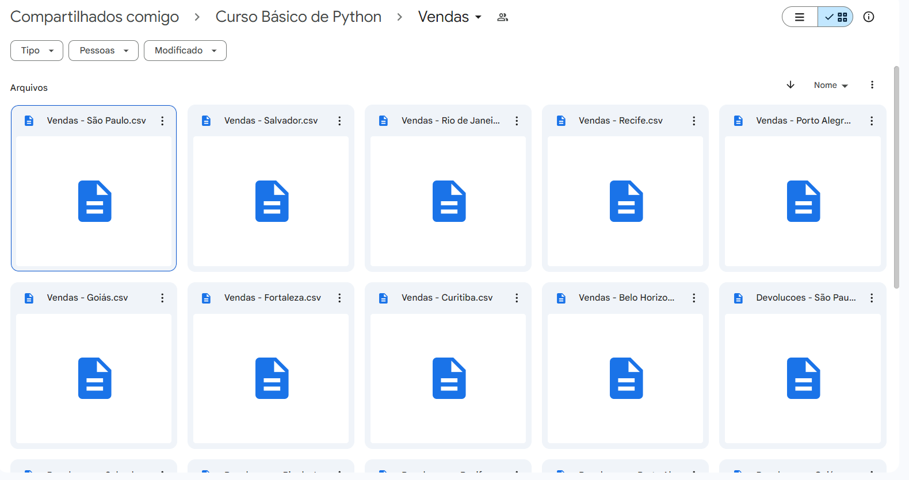
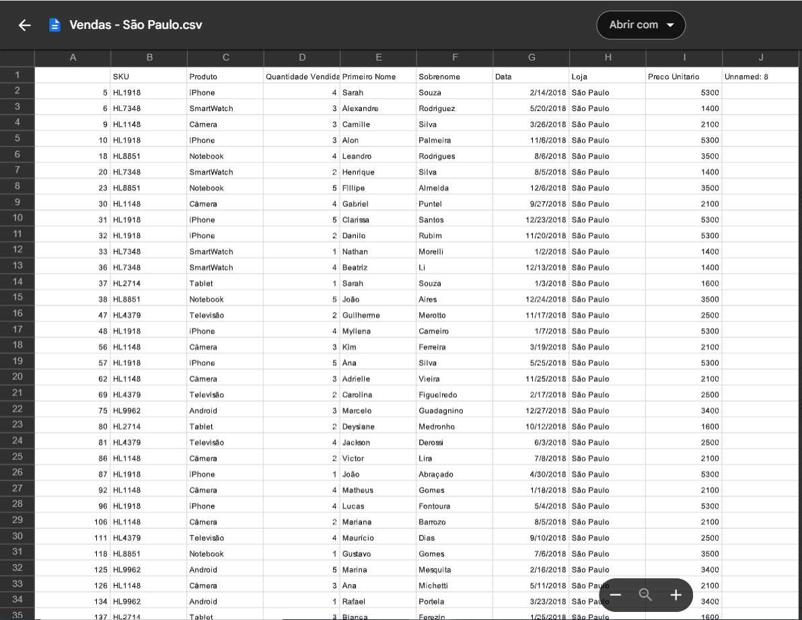
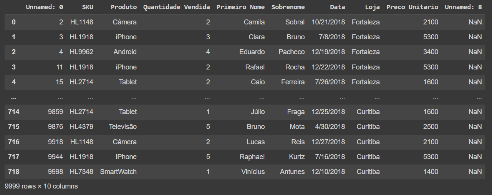
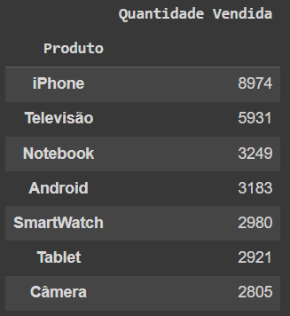
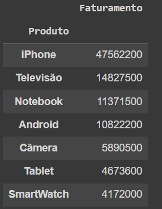
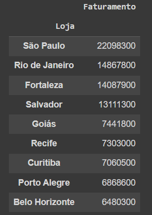
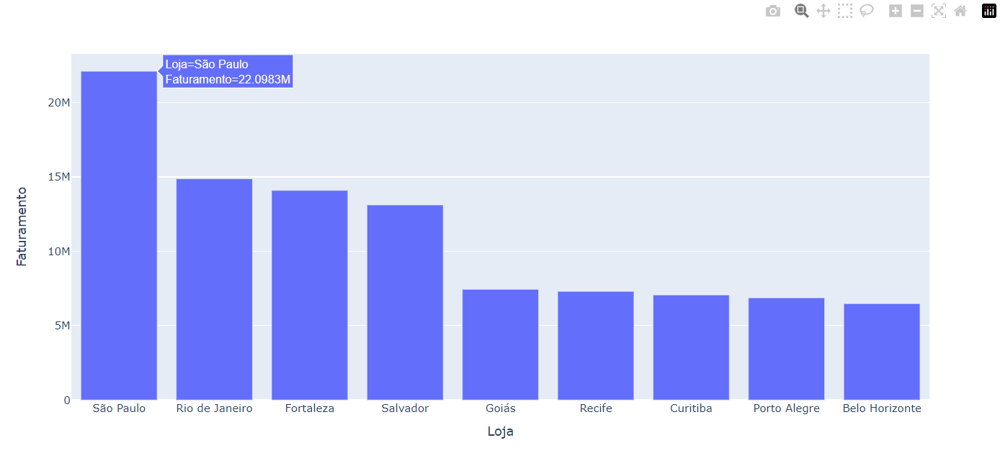

# Análise de Vendas em Python

Este repositório é um projeto básico em Python para análise de informações de uma planilha de vendas. Este conteúdo foi ministrado pela plataforma Hashtag Treinamentos, em formato de minicurso gratuito. Segue o link para quem também tiver interesse de aprender!

<a href="https://pages.hashtagtreinamentos.com/minicurso-python-curso-basico-python-obrigado?blog=1n4033rer&video=3zd56c2h7">CURSO BÁSICO DE PYTHON</a>

## Funcionalidades

- Identificação do Produto Mais Vendido
- Cálculo do Produto com Maior Faturamento
- Determinação da Loja que Mais Faturou

## Info's

Programado inicialmente através do [Google Colab](https://colab.research.google.com/drive/1kFmEsK7w_UZm6OwTvWx9UxULItg5gn8Q?usp=sharing)

---
 

## Visualização das informações

- Tabela extraida do Drive:

- Dados importados para o Colab:

- Indicador: Produto mais Vendido

- Indicador: Produto com maior Faturamento

- Indicador: Loja que mais vendeu

- Dashboard simples: 

